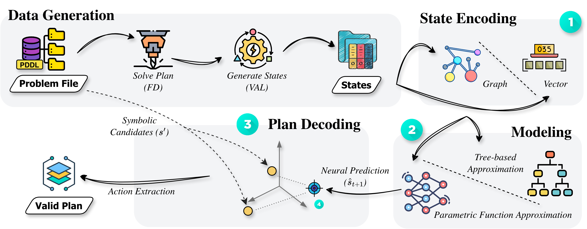

# On Sample-Efficient Generalized Planning via Learned Transition Models

<p align="center">
  <a href="https://icaps26.icaps-conference.org/">
    
  </a>
  <a href="LICENSE">
    
  </a>
  <a href="https://arxiv.org/abs/2602.23148">
    
  </a>
</p>

Official implementation of the paper **"On Sample-Efficient Generalized Planning via Learned Transition Models"**, accepted at **ICAPS 2026**.

We propose a **state-centric** formulation for generalized planning. Instead of predicting actions directly (like Plansformer or PlanGPT), our models learn the domain physics (transition dynamics) and generate plans by rolling out symbolic state trajectories in a latent space. This approach achieves superior Out-of-Distribution (OOD) generalization with significantly smaller models and less data.

## Abstract

Generalized planning studies the construction of solution strategies that generalize across families of planning problems sharing a common domain model. While recent Transformer-based planners cast generalized planning as direct action-sequence prediction, they often suffer from state drift in long-horizon settings. In this work, we formulate generalized planning as a transition-model learning problem. Our results show that learning explicit transition models yields higher out-of-distribution satisficing-plan success than direct action-sequence prediction, while achieving these gains with significantly fewer training instances and smaller models.

## Main Architecture



**Figure: State-Centric Generalized Planning Pipeline.**
From a symbolic planning instance $\Pi$, executable plans are generated using a learned transition model.
**(1) State Encoding:** Symbolic state-goal pairs $(s_t, g)$ are mapped to fixed-dimensional embeddings $\phi(s_t)$ using either WL graph kernels or fixed-size factored vectors.
**(2) Transition Modeling:** A parametric model (LSTM) or a non-parametric model (XGBoost) learns residual state transitions $\Delta_t$ to predict successor embeddings.
**(3) Neuro-Symbolic Plan Decoding:** The predicted successor embedding $\hat{\phi}(s_{t+1})$ is matched against all valid symbolic successors $\mathrm{Succ}(s_t)$ induced by $\gamma$, and the nearest valid successor is selected to recover the executable action.
This guarantees symbolic validity while enabling transition-model-based generalization.

## Quick Start

### Prerequisites

We recommend using [`uv`](https://docs.astral.sh/uv/) for dependency management, or standard `pip`.

```bash
# Option A: Using uv (Recommended)
uv sync

# Option B: Standard pip (requirements.txt was generated from the uv environment)
pip install -r requirements.txt
```

### 1. Data Generation

The entire data generation pipeline can be run with the `1_data_pipeline.slurm` shell script, which is ideal for cluster execution. Alternatively, you can run the individual python modules locally to generate plans, reconstruct state trajectories, and compute graph embeddings:

```bash
# Assumes uv environment is activated. If using pip, ensure you have the required dependencies installed.

# Runs Fast Downward -> VAL -> WL Hashing
# Adjust --workers based on your CPU core count
python -m code.data-processing.generate_plans --workers 8
python -m code.data-processing.generate_states --workers 8
python -m code.encoding-generation.generate_graph_embeddings
```

### 2. Training & Evaluation

The entire training and evaluation pipeline can be executed with the `2_train_eval.slurm` shell script. Below are the individual commands to train the transition models (LSTM or XGBoost) and evaluate on OOD instances:

```bash
# Assumes uv environment is activated. If using pip, ensure you have the required dependencies installed.

# Train LSTM with Delta prediction on Graph Embeddings
python -m code.modeling.train_lstm \
  --domain blocks \
  --data_dir data/encodings/graphs \
  --save_dir checkpoints/graphs/lstm_delta \
  --delta

# Run Inference (Latent Beam Search)
python -m code.modeling.inference_lstm \
  --domain blocks \
  --checkpoint checkpoints/graphs/lstm_delta/blocks_lstm_best_seed15.pt \
  --encoding graphs \
  --results_dir results/graphs/lstm_delta \
  --delta
```

### 3. Automated Results Aggregation

For the aggregation step, execute the following command locally to parse the inference logs and generate a markdown table, or a csv, summarizing the coverage results:

```bash
# Assumes uv environment is activated. If using pip, ensure you have the required dependencies installed.

# Generate the results table (Coverage %) from the inference logs to markdown format
python -m code.analysis.aggregate_results --format markdown
```

Note that this step should be performed after all inference runs are complete, as it reads the JSON logs generated during inference to compute the final coverage metrics.

## Repository Structure

- `code/`: Source code for data generation, modeling, and analysis.
- `data/`: Stores PDDL, plans, state trajectories, and vector encodings.
- `checkpoints/`: Saved model weights.
- `results/`: JSON logs containing validation results for every test problem.

## Acknowledgments

This project used the [Fast Downward planner](https://github.com/aibasel/downward) for plan generation and the [VAL tool](https://github.com/KCL-Planning/VAL) for plan validation. We also thank the [WLPlan library](https://github.com/DillonZChen/wlplan) specifically for providing a powerful tool for state encoding. Lastly, we also thank all other libraries and tools used in this project (detailed in `pyproject.toml`).

Do note that this project uses a forked version of WLPlan, which we modified to work on MacOS systems. The fork can be found at [https://github.com/g-nitin/wlplan](https://github.com/g-nitin/wlplan).

## Citation

If you find this work useful, please cite as:

```bibtex
@article{gupta2026sample,
  title={On Sample-Efficient Generalized Planning via Learned Transition Models},
  author={Gupta, Nitin and Pallagani, Vishal and Aydin, John A and Srivastava, Biplav},
  journal={arXiv preprint arXiv:2602.23148},
  year={2026}
}
```

## Contact

For questions or feedback, please open an issue or contact [ai4societyteam@gmail.com](mailto:ai4societyteam@gmail.com).
